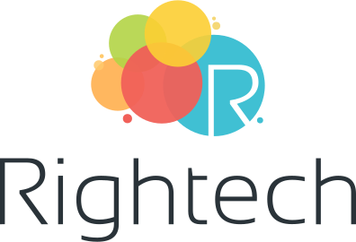

  

Rightech IoT Cloud (RIC) — это облачная платформа Интернета Вещей, выступающая в качестве связующего звена при разработке IoT-решений. Для получения более подробной информации посетите [портал rightech.io](http://rightech.io). В этом репозитории вы можете сообщать нам о найденных проблемах и оставлять свои предложения по развитию платформы.

### Полезные ссылки
- [Платформа](https://dev.rightech.io)
- [Актуальный release notes](./release-notes/v2_5.md)
- [Документация](https://rightech.io/developers/introductions/)
- [Видеоуроки](https://rightech.io/video-tutorials/)
- [Telegram-чат](https://t.me/rightech_iot) 
- [Telegram-канал](https://t.me/rightechportal) 
- [Сообщество ВК](https://vk.com/rightech)
