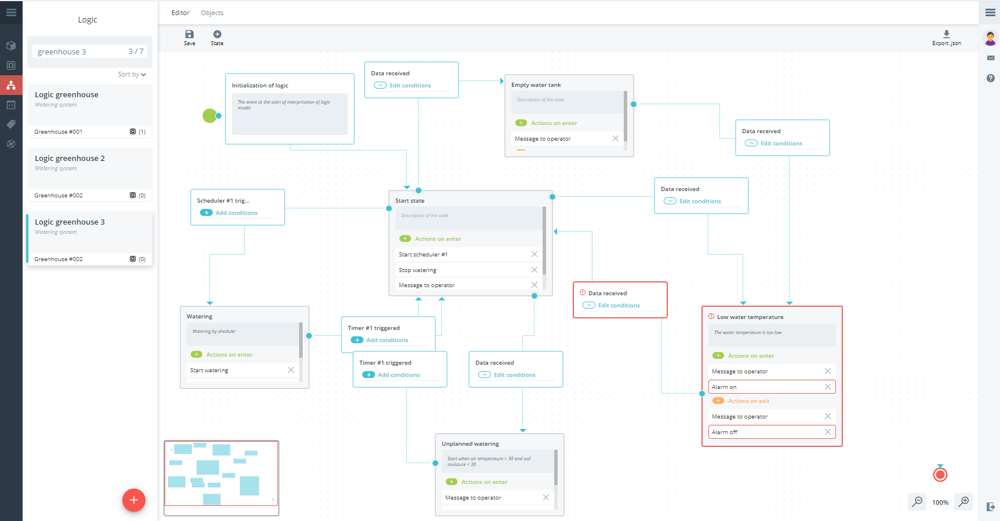

# Rightech IoT Cloud v2.2
*26 октября 2020, команда Rightech*

В этом квартале мы работали в основном над стабильностью платформы, но помимо это добавили ряд новых полезных функций:
* [Import/export сущностей платформы](#importexport-сущностей-платформы), а именно [моделей](#модели), [объектов](#объекты) и [автоматов](#автоматы)  
* [Редактор автоматов](#редактор-автоматов)  
* [Ric-app](#ric-app)

### Import/export сущностей платформы
Все сущности в платформе представляют собой JSON-файлы. Такой формат легко читается и позволяет организовать удобный обмен данными. Сейчас стала доступна возможность импортировать некоторые сущности платформы. Теперь вы можете делиться своими наработками, узнавать мнение комьюнити о своих идеях, использовать готовые решения других пользователь. Мы со своей стороны будем делиться собственным опытом и наполнять интересными проектами и находками вот этот [репозиторий]( https://github.com/Rightech/ric-examples).
Вы можете экспортировать отдельные элементы своих решений в формате JSON и делиться такими файлами по своему усмотрению или, например, создавать резервные копии. Импорт сущностей возможен из файлов или напрямую по ссылке, например, через raw-режим просмотра файлы на github.

#### Модели
Возможность переиспользовать модель приобретает значительную ценность для того, чтобы передать программный код объекта (например скетч ардуино) вместе с его моделью. Раньше приходилось создавать новые модели самостоятельно и вручную.

Экспорт модели:

Импорт модели из файла:

Импорт модели по ссылке:

#### Объекты
Это пригодится, если есть необходимость поделиться с другим пользователем объектом с уже настроенной конфигурацией и подробным описанием. Внутри своего аккаунта удобнее пользоваться функцией копирования объектов.  

Экспорт объекта:  
  
Импорт объекта из файла:  
  
Импорт объекта по ссылке:  
  

#### Автоматы
Теперь появилось возможность поделиться своими сценариями и использовать автоматы других пользователей. Изучайте опыт других пользователей. Делитесь своими достижениями. Спрашивайте совета и не бойтесь критики. Мы также будем выкладывать собственные проекты на github, например те решения, которые уже используются в нашем офисе и в жизни наших работников.  
   
Экспорт объекта:  
  
Импорт объекта из файла: 
  
Импорт объекта по ссылке:  
  

### Редактор автоматов
Расширена информативность интерфейса создания и редактирования автоматов. Сущности модель и автомат тесно связаны. При этом может возникнуть ситуация их несоответствия. Например, когда модель редактируется после создания автомата или при попытке использовать один автомат с разными моделями. Так же это важно при импорте автоматов со сторонних источников. Возникающие при этом ошибки приводят к тому, что в исполняемом автомате могут оказаться параметры, команды и события, которых нет в модели устройства. Соответственно, при исполнении такого автомата эти параметры не могут участвовать в проверке условий, события не могут вызвать перехода, а команды не будут быть отправлены.
  
**Автомат с ошибками может быть сохранен и запущен**, но стоит обратить внимание на возможные проблемы.  

Автомат с ошибками:  
  

#### Состояния
В состояниях автомата может возникнуть ситуация, когда в модели отсутствует выбранные действия, например, отправка команды при смене состояния автомата. Это может случится при редактировании модели устройства, изменении модели выбранной в автомате, импорте автомата. Действия, отсутствующие в модели, не смогут быть выполнены во время его выполнения и будут проигнорированы.
  

Ошибки в состоянии:  

#### Переходы
Возникающие в переходах ошибки влияют на механизм смены состояний в исполняемом автомате. Событие, которое вызывает переход, не может произойти и условие, которое проверяется, не будет выполнено.
В переходах возможно несколько вариантов ошибок:  
* Отсутствие события, которое вызывает переход между состояниями;
* Отсутствует параметр, который используется в условии перехода.  

Ошибки в переходах:  

### Ric-app
Рады сообщить, что у нас есть мобильная версия платформы. Приложение обладает основными возможностями платформы связанные с контролем в реальном времени состояния объекта и его местоположения, управлять объектам посредством отправки команд, следить за оповещениями платформы. Приложение для Android доступно в Play Market по [ссылке](https://play.google.com/store/apps/details?id=io.rightech.app&hl=en_US).  

Приложения для iOS в скором времени появится в App Store.

#### Объекты
В списке объектов видна информация о статусе объектов. Можно зайти в каждый объект, посмотреть все его параметры, историю пакетов. Кроме того, доступна возможность отправки команд на устройства.

Список объектов:  

Состояние объекта:  

История объекта:  

Управление объектом:  

#### Карта
Меню с картой, аналогичное карте в интерфейсе платформы.  
Карта:  

#### Оповещения
Сообщения, генерируемые в автоматах также видны в мобильном приложении в меню с сообщениями.  
Оповещения:  

---
С каждым новым релизом мы прислушиваемся к вашему фидбэку. Мы благодарим каждого, кто оставляет свои отзывы и предложения. Благодаря вам мы становимся лучше, продолжаем совершенствовать платформу, сохраняя при этом ее простоту  использования.
Присоединяйтесь к нашим соцсетям и осталяйте обратную связь! 

Следите за новостями на нашем [Telegram-канале](https://t.me/rightechportal). В [Telegram-чате](https://t.me/rightech_iot) можно познакомиться с единомышленниками и получить ответы на имеющиеся вопросы.

Полезные ссылки:

* [Документация](https://rightech.io/developers/introductions/)
* [Видеоуроки](https://rightech.io/video-tutorials/)
* [Github](https://github.com/Rightech)
* [Сообщество ВК](https://vk.com/rightech)
* [Сообщество Facebook](https://www.facebook.com/rightechllc/)