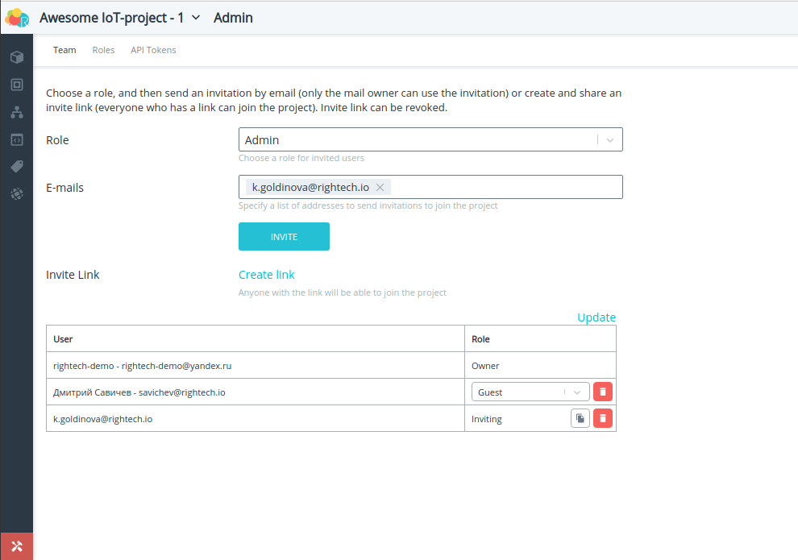

# Rightech IoT Cloud v2.3
*11 февраля 2020, команда Rightech*

Подготовка этого релиза была напралена на внедрение механизмов совместного использования платформы. Мы хотим дать пользователям инстурменты коллективной работы над их IoT-проектом. Решение, связанных с этим задач повлияло на много части платформы в том числе и на основной интерфейс:

* [Проекты](#проекты). Теперь пользователи могут [создавать](#создание-проекта) проекты, [управлять](#администрирование-проектов), [приглашать пользователей](#команда) в свои проекты. Значительно изменился подход к [созданию лицензий](#тарификация-проектов). 
* Небольших изменений притерпело и [меню](#меню) платформы.
* Новая базовая модель для работы с [LoRaWAN устройствами](#lorawan). 
* Новый интерфейс для настройка событий [геозон](#геозоны-выбор-событий)
* [Двухфакторная аутентифкация](#двухфакторная-аутентифкация-2fa) с помощью приложений-аутентификаторов
* Дополнительные возможности для [оповещений](#оповещения-рябь-браузерные-пуши)

### Проекты
В этом релизе мы решили пересмотреть процесс создания IoT-решений на базе платформы. Мы вводим новое для платформы понятие Проекты. Проект - это место, где создается ваше IoT-решение. Проекты независимы и никак не пересекаются между собой. Кроме того, проект - это удобный инструмент для совместного создания вашего IoT-продукта. Вы можете приглашать в свой проект других пользователей, при необходимости настраивать их роль, т.е. ограничивая возможности управления отдельными частями проекта (подробнее об этом в разделе [роль](#роль) и [команда](#команда). 

Пользователи в любой момент могут переключаться между своими проектами и проектами, в которых они участвуют. 
Переключение проектов:  
  

#### Создание проекта
Чтобы создать новый проект необходи перейти в меню управления проектами (через личный кабинет или по клику на кнопку в меню выбора проектов). 
Создание проектов:  
  
#### Администрирование проектов
В основном меню платформы появился новый раздел с администрирование проекта. В этом разделе находится инструменты для управленией командой проекта, настройкой ролей и генерации API-Токенов
##### Команда
Меню управления командой позволяет приглашать других участников присоединиться к проекту. 
Команда проекта:  
   
Существуют две возможности пригласить человека в проект. В обоих случая необходимо выбрать роль с которой пользователь будет присоединяться к проекту.
1. Отправка ссылки на e-mail пользователя. В этом случае на его почту придёт письмо с ссылкой для принятия приглашения. ВАЖНО: Эта ссылка работает только для конкретной почты. Если у получателя письма нет аккаунта Rightech, то чтобы принять приглашение он должен зарегистрироваться в платформе. Повторно отправлять приглашение не нужно. Такие ссылки истекают через 24 часа.
2. Создать универсальную ссылку с помощью кнопки создать ссылку (англ. Create link). В этом случае любой пользователь, зарегистрированный в платформе, сможет присоединиться к платформе по этой ссылке. Такие ссылки работают до тех пор пока они не отозваны администратором или не исчерпается лимит пользователей проекта.  

На этой странице есть возможность видеть список пользователей, их роли и статус отправленных приглашений. Владелец проекта может удалять пользователей, менять им роль и, при необходимости, повтороно отправить приглашение.
##### Роль
Для того чтобы приглашать пользователей 
##### API Токены 
Генерация API токенов была убрана из личного кабинета и теперь относится строго к проекту. То есть сейчас, создавая новый токен, вы даете API-доступ только к конкретному проекту. Интерфейс этого инструмента не существенно не изменился.
Api-Токены:  
  
#### Тарификация проектов
Теперь лицензия привязана к проектам и, создавая его, вы выбираете параметры, которые будут применяться для всех объектов внутри проекта. Ранее лицензия привязывалась к объектам. Такой подход был непрозрачен и вызывал неудобства у некоторых пользователей. Все данные текущих пользователей мы перевили на новый интерфейс с проектами. Если кого-то появятся вопросы по его аккаунту - пишите в [telegram-чат](https://t.me/rightech_iot) или на [почту](mailto:development@rightech.io?subject=Support). Мы постараемя оперативно решить все вопросы.  
Каждый пользователь сможет бесплатно создать 2 проекта. Кроме того, основные параметры бесплатных лицензий были значительно увеличины.

Тип ограничения | Значение
----- | -----
Количество объектов | 10
Максимальный размер пакета, байт | 256
Пакетов в сутки с одного объекта | 1440 (~1/мин)
Количество автоматов, запущенных на объекте | 2
Количество обработчиков, запущенных на объекте | 1
Размер хранилища для одного устройства, Мбайт | 10


### Меню
Появление такой фичи как "Проекты" потребовало заметное, хоть и небольшое, обновление интерфейса. Кнопки "Информация" и "Сообщения" переехали на новое верхнее меню. У кнопки входа в личный кабинет появилось дополнительные подменю для упрощения навигации. В это же подменю перенесена кнопка выхода из аккаунта Rightech.  
Меню:  
  
### Lorawan
В список базовых моделей для всех добавлена модель для LoRaWAN устройств. При создании объекта с такой моделью необходимо указать параметры, которые требуются для авторизации устройства. Подробнее процесс подключения устройств LoRaWAN мы опишем в последующий статьях. Это первая итерация LoRaWAN в нашей платформе, поэтому мы просим пользователей сообщать о возможных проблемах с подключением устройств и делиться своими идеями по улучшению работы с такими устройствами.   
Экран создания объекта:  
      
Для настройки Packet Forwarder на наш сервер необходимо указать следующие параметры:
```
"gateway_conf": {
        "server_address": "sandbox.rightech.io",

        /* for EU868 */
        "serv_port_up": 1700,
        "serv_port_down": 1700,

        /* for RU864 */
        "serv_port_up": 1701,
        "serv_port_down": 1701,
}   
```

### Геозоны. Выбор событий 
Теперь при назначении геозон на объекты можно выбрать события, которые будут генерироваться при входе/выходе из конкретной геозоны. По умолчанию назначаются события предопределенные в каждой модели устройств (Вход в геозону / Выход из геозоны).  
Выбор событий для геозон упрощает контроль нескольких геозон для одного объекта. Так, чтобы решить простую задачу с определением случаев входа в разрешенную или запрещенную геозону необходимо:   
1. Добавить в модель соответствующие события   
      
2. Нарисовать геозону (тут ничего не поменялось)
3. Назначить ее на объект и выбрать события.
   
4. Нарисовать и запустить автомат, который будет исполнять логику по этим событиям
   

### Двухфакторная аутентифкация (2FA)
Безопасность вашей учётной записи очень важна для нас. RIC дает возможность включить двухфакторную аутентификацию (2FA), чтобы защитить вашу учетную запись от несанкционированного входа. При активированной двухфакторной аутентификации для входа в вашу учетную запись вам понадобятся пароль и мобильное устройство с установленным приложение-аутентификатором (например, Google Authenticator).  
Вход с помощью 2FA:   
  
Чтобы включить это возможность нужно перейти в соответствующий раздел в личном кабинете и отсканировать QR-код через приложение для аутентификации на вашем мобильном устройстве. Двухфакторную аутентификацию можно выключить в любой момент, но для этого потребуется ваше приложение-аутентификатор.
Настройки 2FA:
| | |
| :-: | :-: |
|  |  |

### Оповещения. Рябь, браузерные пуши, 
Мы изменили подход к критическим оповещениям в платформе. Теперь включение настройки "Доп. оповещения" в личном кабинете добавляет дополнительную индикацию Критическим сообщениям в платформе. 
Включение дополнительных оповещений:  
    
После включения этой опции бразуер запросит разрешение на отсылку критических push-сообщений платформы, но на это можно и не соглашатся. 

Индикация критических сообщений:  
    
Включение этой опции приводит к тому, что при появлении критического сообщения просиходит следующее:
1. На плашке объекта появляется иконка, которая показывает наличие непрочитанных критических сообщений. При клике на нее к окну Сообщений применяется фильтр по этому объекту.
2. Вокруг маркера объекта на карте появляется оранжевая индикация "Рябь"
3. Звуковое оповещение
4. Push-уведомление браузера с текстом сообщения, если они разрешены для страницы платформы. На скриншоте ниже пример такого сообщения в ОС Ubuntu в браузере Google Chrome.
   
Браузерное push-уведомление:  
 
