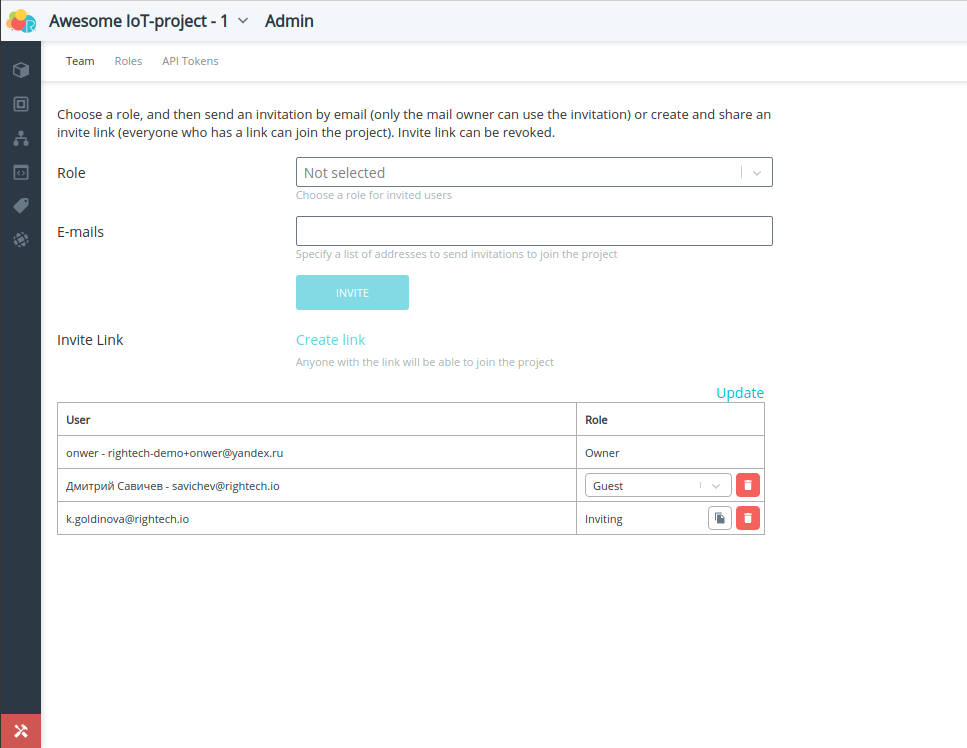
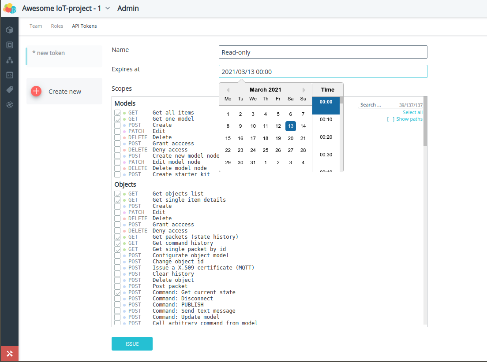

# Rightech IoT Cloud v2.3
*11 февраля 2020, команда Rightech*

Подготовка этого релиза была напралена на внедрение механизмов совместного использования платформы. Мы хотели дать пользователям инстурменты коллективного управления IoT-проектом. Решение связанных с этим задач повлияло на многие элементы платформы:

* [Проекты](#проекты). Теперь пользователи могут [создавать](#создание-проекта) проекты, [управлять](#администрирование-проектов) ими и [приглашать](#команда) других пользователей присоединиться. Так же мы значительно изменили подход к [механизмам тарификации](#тарификация-проектов). 
* Интерфейс [платформы](#меню) немного изменился из-за появления проектов.
* Добавлена новая базовая модель для работы с [LoRaWAN устройствами](#lorawan). 
* Новый интерфейс для настройки событий [геозон](#геозоны-выбор-событий).
* Добавлена возможность включить [двухфакторную аутентифкацию](#двухфакторная-аутентифкация-2fa).
* [Оповещения](#оповещения-рябь-браузерные-пуши) о критических сообщениях.

### Проекты
В этом релизе мы решили пересмотреть процесс создания IoT-решений на базе платформы. Мы вводим новое для платформы понятие - Проекты. Проект - это место, где создается ваш IoT-кейс. Это отдельное пространство, которое независимо и никак не пересекается с другими вашими проекстами. Кроме того, проект - это удобный инструмент для совместного создания вашего IoT-решения. В проект можно приглашать других пользователей. Для разных пользователей можно определить разные роли, т.е. определить доступные им возможности управления проекта, начиная от создания и редактирование объектов, до отправки команд (подробнее об этом в разделе [роль](#роль) и [команда](#команда)). 

Пользователи в любой момент могут переключаться между своими проектами и проектами, в которых они участвуют. 
Переключение проектов:  
  

#### Создание проекта
Чтобы создать новый проект необходимо перейти в меню управления проектами (через личный кабинет или по клику на кнопку в меню выбора проектов).  
Создание проектов:   
  
#### Администрирование проектов
В основном меню платформы появился новый раздел с администрирование проекта. В этом разделе находится инструменты для управленией командой проекта, настройкой ролей и генерации API-Токенов.
##### Команда
Меню управления командой позволяет приглашать других участников присоединиться к проекту.   
Команда проекта:  
   
Существуют два способа пригласить человека в проект. В обоих случая необходимо выбрать роль с которой пользователь будет присоединяться к проекту.  
Способы пригласить в проект:
1. Отправка ссылки на e-mail пользователя. В этом случае на его почту придёт письмо с ссылкой для принятия приглашения. ВАЖНО: Эта ссылка работает только для конкретной почты. Если у получателя письма нет аккаунта Rightech, то чтобы принять приглашение он должен зарегистрироваться в платформе. В этом случае повторно отправлять приглашение не нужно. Такие ссылки истекают через 24 часа. Присоединиться к проекту с друим аккаунтом не получится.  
2. Создать универсальную ссылку с помощью кнопки "Создать ссылку" (англ. "Create link"). В этом случае любой пользователь, зарегистрированный в платформе, сможет присоединиться к платформе по этой ссылке. Такие ссылки работают до тех пор пока они не отозваны администратором или не исчерпается лимит пользователей проекта.  

На этой странице располагается список пользователей проекта, их роли и статус отправленных приглашений. Владелец проекта может исключать пользователей из проекта, изменять им роль и, при необходимости, повтороно выслать приглашение.
##### Роль
Для того чтобы приглашать пользователей необходимо выбрать с которой они присоединятся к проекту. По умолчанию доступна роль с максимальными правами для управления объектами. Однако, управление проектом (редактирование проекта, приглашение новых пользователей, операции связанные с оплатой подписики и т.д.) сейчас доступны только владельцу проекта. 

##### API-Токены 
Генерация API токенов была перемещена из личного кабинета пользователя и теперь относится только к проекту. Это значит, что сейчас API-доступ по токену предоставляется только к конкретному проекту. Сам интерфейс этого инструмента не изменился.  
API-Токены:  
  
#### Тарификация проектов
Теперь лицензия привязана к проектам и настраиваются параметры, которые будут применяться для всего проекта. Ранее лицензия привязывалась к объектам. Такой подход был непрозрачен и вызывал неудобства у некоторых пользователей. Текущих пользователей платформы мы перевили на новый механизм основанный на проектах. Если у кого-то появятся вопросы по его аккаунту - пишите нам в [telegram-чат](https://t.me/rightech_iot) или на [почту](mailto:development@rightech.io?subject=Support). Мы постараемя оперативно решить все вопросы.  
Каждый пользователь сможет бесплатно создать два проекта. Кроме того, основные параметры бесплатных лицензий были значительно увеличины, чтобы упростить процесс знакомства с возможностями платформы.

Тип ограничения | Значение
----- | -----
Количество объектов | 10
Максимальный размер пакета, байт | 256
Пакетов в сутки с одного объекта | 1440 (~1/мин)
Количество автоматов, запущенных на объекте | 2
Количество обработчиков, запущенных на объекте | 1
Размер хранилища для одного устройства, Мбайт | 10


### Меню
Появление "Проектов" сопровождается небольшим обновлением интерфейса платформы. Правое меню было удалено. Кнопки "Информация" и "Сообщения" переехали на новое верхнее меню. Верхнее меню включает в себя механизм смены проектов У кнопки входа в личный кабинет появилось дополнительные подменю для упрощения навигации по личному кабинету. В это же подменю перенесена кнопка выхода из аккаунта Rightech.  
Меню:  
  
### LoRaWAN
В список базовых моделей для всех добавлена модель для LoRaWAN устройств. При создании объекта с такой моделью необходимо указать параметры, которые требуются для авторизации устройства. Подробнее процесс подключения устройств LoRaWAN мы опишем в документации. Это первая итерация LoRaWAN в нашей платформе, поэтому мы просим пользователей сообщать о возможных проблемах с подключением устройств и делиться своими идеями по улучшению работы с LoRaWAN-устройствами.   
Экран создания объекта:  
      
Для настройки Packet Forwarder на наш сервер необходимо указать следующие параметры:
```
"gateway_conf": {
        "server_address": "sandbox.rightech.io",

        /* for EU868 */
        "serv_port_up": 1700,
        "serv_port_down": 1700,

        /* for RU864 */
        "serv_port_up": 1701,
        "serv_port_down": 1701,
}   
```

### Геозоны. Выбор событий 
Теперь при назначении геозон на объекты можно выбрать события, которые будут генерироваться при входе/выходе из конкретной геозоны. По умолчанию назначаются события предопределенные в каждой модели устройств (Вход в геозону / Выход из геозоны).  
Выбор событий для геозон упрощает контроль нескольких геозон для одного объекта. Так, чтобы решить простую задачу с определением случаев входа в разрешенную или запрещенную геозону необходимо:   
1. Добавить в модель соответствующие события   
      
2. Нарисовать геозону (тут ничего не изменялось)
3. Назначить ее на объект и выбрать события.
   
4. Создать и запустить автомат, который будет исполнять сценарий с учётом генерируемых событий.
   

### Двухфакторная аутентифкация (2FA)
Безопасность учётных записей пользователей очень важна для нас. RIC дает возможность включить двухфакторную аутентификацию (2FA), чтобы защитить вашу учетную запись от несанкционированного входа. При включенной двухфакторной аутентификации для входа в аккаунт необходимо дополнительно ввести код с мобильного устройство с установленным приложением-аутентификатором (например, Google Authenticator или аналоги).  Операция смены пароля тоже потребуе дополнительного подтверждения.  
Вход с помощью 2FA:   
  
Чтобы включить это возможность нужно перейти в соответствующий раздел в личном кабинете и отсканировать QR-код через приложение для аутентификации на вашем мобильном устройстве. Двухфакторную аутентификацию можно выключить в любой момент, но для этого потребуется ваше приложение-аутентификатор.
Настройки 2FA:
| | |
| :-: | :-: |
|  |  |

### Оповещения. Рябь, браузерные пуши, 
Мы изменили подход к критическим оповещениям в платформе. Теперь включение настройки "Доп. оповещения" в личном кабинете добавляет дополнительную индикацию Критическим сообщениям в платформе. 
Включение дополнительных оповещений:  
    
После включения этой опции бразуер запросит разрешение на отсылку критических push-сообщений платформы, но на это можно и не соглашатся. 

Индикация критических сообщений:  
    
Включение этой опции приводит к тому, что при появлении критического сообщения просиходит следующее:
1. На плашке объекта появляется иконка, которая показывает наличие непрочитанных критических сообщений. При клике на нее к окну Сообщений применяется фильтр по этому объекту.
2. Вокруг маркера объекта на карте появляется оранжевая индикация "Рябь"
3. Звуковое оповещение
4. Push-уведомление браузера с текстом сообщения, если они разрешены для страницы платформы. На скриншоте ниже пример такого сообщения в ОС Ubuntu в браузере Google Chrome.
   
Браузерное push-уведомление:  
 
