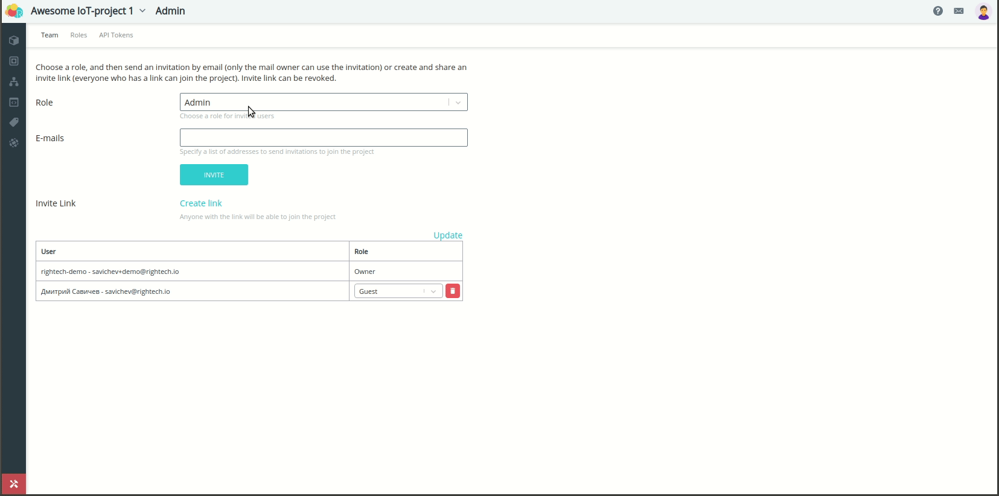
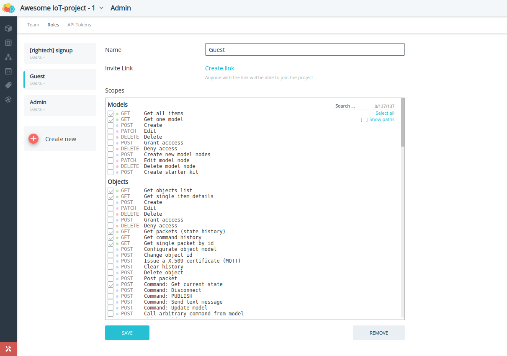
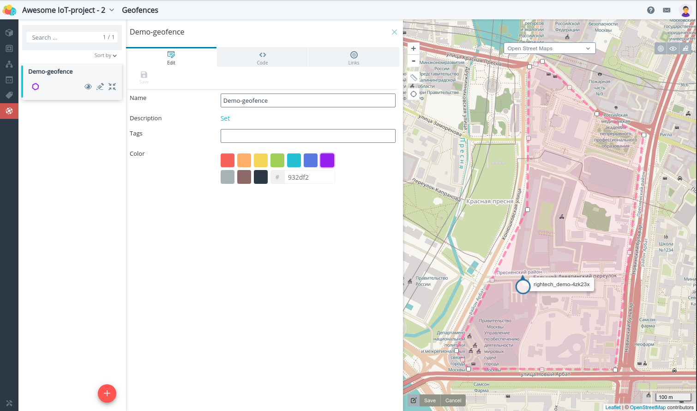
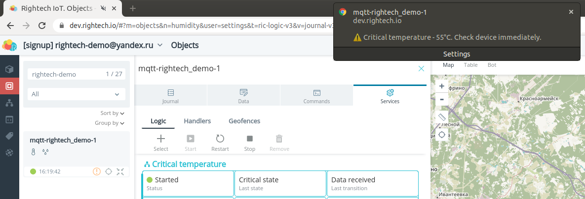

# Rightech IoT Cloud v2.3
*11 февраля 2020, команда Rightech*

Подготовка этого релиза была направлена на внедрение механизмов совместного использования платформы. Мы хотели дать пользователям инструменты коллективного управления IoT-проектом.  

Список основных изменений в платформе:
* создание и управление [проектами](#проекты) - теперь пользователи могут [приглашать](#команда) других пользователей присоединиться к проекту
* изменение подхода к [тарификации](#тарификация-проектов) 
* изменения в [интерфейсе платформы](#интерфейс-платформы)
* новая базовая модель для работы с [LoRaWAN устройствами](#lorawan) 
* интерфейс для настройки событий [геозон](#геозоны-выбор-событий)
* возможность включить [двухфакторную аутентификацию](#двухфакторная-аутентификация-2fa)
* настройка [оповещений](#оповещения-критических-сообщений) о критических сообщениях.

### Проекты
В этом релизе мы решили пересмотреть процесс создания IoT-решений на базе платформы. Мы вводим новое для платформы понятие - Проекты. Проект - это место, где создается ваш IoT-кейс. Это отдельное пространство, в котором находятся пользовательские модели, объекты, автоматы и другие сущности платформы, связанные с вашим конкретным IoT-проектом. Проекты изолированы и никак не пересекаются между собой. Кроме того, проект - это удобный инструмент для совместного создания IoT-решения, т.к. в него могут быть приглашены другие пользователи. Для разных пользователей можно задать индивидуальные роли, т.е. определить доступные им возможности - от создания и редактирования объектов до отправки команд (подробнее об этом в разделах [роль](#роль) и [команда](#команда)). 

Пользователи в любой момент могут переключаться между своими проектами и проектами, в которых они участвуют.  
Переключение между проектами:  
  

#### Создание проекта
Чтобы создать новый проект, необходимо перейти в меню управления проектами (через личный кабинет или по клику на кнопку в меню выбора проектов).  
Создание проектов:   
  
#### Администрирование проектов
В основном меню платформы появился новый раздел управления проектом - Администратор. В нем находятся инструменты для управления командой проекта, настройки ролей и создания API-токенов.
##### Команда
Меню управления командой позволяет приглашать других участников присоединиться к проекту.   
Команда проекта:  
  

Есть два способа пригласить человека в проект. В обоих случаях необходимо определить роль, с которой пользователь будет участвовать в проекте.  

Способы пригласить в проект:
1. Отправка ссылки на e-mail пользователя. В этом случае на его почту придет письмо со ссылкой для принятия приглашения. ВАЖНО: Эта ссылка работает только для указанного в приглашении e-mail. Если у получателя письма нет аккаунта Rightech, то, чтобы принять приглашение, он должен зарегистрироваться в платформе с этим адресом электронной почты. Ссылки такого типа истекают через 24 часа. Присоединиться к проекту по ссылке с другим аккаунтом не получится.  
2. Создать универсальную ссылку с помощью кнопки "Создать ссылку". В этом случае любой пользователь, зарегистрированный в платформе, сможет присоединиться к проекту по этой ссылке. Ссылки такого типа работают до тех пор, пока они не отозваны администратором и лимит пользователей проекта не исчерпан.  

В разделе Команда располагается список пользователей проекта, их роли и статус отправленных приглашений. Владелец проекта может исключать пользователей из проекта, изменять им роль и при необходимости повторно высылать приглашение.
##### Роли
Для того чтобы приглашать пользователей, необходимо выбрать роль, с которой они присоединятся к проекту. По умолчанию доступна роль с максимальными правами для управления объектами, но можно создать другие роли с любым набором доступных функций. Функции по управлению проектом (редактирование проекта, приглашение новых пользователей, операции, связанные с оплатой подписки и т.д.) сейчас доступны только владельцу проекта.  
Редактор ролей:  

   
##### API-Токены 
Раздел создания API-токенов был перемещен из личного кабинета пользователя в меню Администратор. Теперь токен относится только к проекту. Это значит, что сейчас API-доступ по токену осуществляется только к конкретному проекту. Сам интерфейс этого раздела не изменился.  
API-токены:  
  
#### Тарификация проектов
Теперь лицензия привязана к проектам и в ней настраиваются параметры, которые будут применяться для всего проекта. Ранее лицензия назначалась на объекты. Такой подход был непрозрачен и вызывал неудобства у пользователей. Текущих пользователей платформы мы перевели на работу с проектами. Если у кого-то появятся вопросы по своему аккаунту - пишите нам в [telegram-чат](https://t.me/rightech_iot) или на [почту](mailto:development@rightech.io?subject=Support). Мы постараемся оперативно решить все вопросы.   

Каждый пользователь может бесплатно создать два проекта. Кроме того, основные параметры бесплатных лицензий были значительно увеличены, чтобы упростить процесс знакомства с возможностями платформы.

Тип ограничения | Значение
----- | -----
Количество объектов | 10
Максимальный размер пакета, байт | 256
Пакеты в сутки с одного объекта | 1440 (~1/мин)
Количество автоматов, запущенных на объекте | 2
Количество обработчиков, запущенных на объекте | 1
Размер хранилища для одного устройства, Мбайт | 10


### Интерфейс платформы
Появление "Проектов" сопровождается небольшим обновлением интерфейса платформы. Правое меню было удалено. Кнопки "Информация" и "Сообщения" переехали на новое верхнее меню. У кнопки входа в личный кабинет появилось дополнительные подменю для упрощения навигации по личному кабинету. В это же подменю перенесена кнопка выхода из аккаунта Rightech. Верхнее меню также включает в себя механизм смены проектов.  
Меню:  
  
### LoRaWAN
В список базовых моделей добавлена модель для LoRaWAN устройств (ее можно выбрать как шаблон при создании модели). Сейчас доступны региональные параметры **EU868** и **RU864**. При создании объекта с такой моделью необходимо указать параметры, которые требуются для авторизации устройства. Подробнее процесс подключения устройств LoRaWAN мы опишем в документации. Это первая итерация работы с LoRaWAN в нашей платформе, поэтому мы просим пользователей сообщать о возможных проблемах с подключением устройств и делиться своими идеями по улучшению работы с LoRaWAN-устройствами. 

Экран создания объекта:  
      
Для настройки Packet Forwarder на наш сервер необходимо указать следующие параметры:
```
"gateway_conf": {
        "server_address": "dev.rightech.io",
        "serv_port_up": 1700,
        "serv_port_down": 1700
    }   
```

### Геозоны. Выбор событий 
Теперь при назначении геозон на объекты можно выбрать события, которые будут генерироваться при входе/выходе из конкретной геозоны. По умолчанию назначаются события, предопределенные в каждой модели устройств (Вход в геозону / Выход из геозоны).  
Выбор событий для геозон упрощает контроль нескольких геозон для одного объекта. Так, чтобы решить простую задачу с определением случаев входа в разрешенную или запрещенную геозону необходимо:   
1. Добавить в модель соответствующие события   
      
2. Нарисовать геозону  
     
3. Назначить ее на объект и выбрать события, которые будут генерироваться при входе/выходе  
   
4. Создать и запустить автомат, который будет исполнять сценарий с учётом генерируемых событий  
   

### Двухфакторная аутентификация (2FA)
Безопасность учётных записей пользователей очень важна для нас. RIC дает возможность включить двухфакторную аутентификацию (2FA), чтобы защитить учетную запись от несанкционированного входа. При включенной двухфакторной аутентификации для входа в аккаунт необходимо дополнительно ввести код с мобильного устройство с установленным приложением-аутентификатором (например, Google Authenticator или его аналоги). 

Вход с помощью 2FA:   
  
Чтобы включить двухфакторную аутентификацию, нужно перейти в соответствующий раздел в личном кабинете и отсканировать QR-код через приложение для аутентификации на вашем мобильном устройстве. Двухфакторную аутентификацию можно выключить в любой момент, но для этого также потребуется приложение-аутентификатор.  
Настройки 2FA:
| | |
| :-: | :-: |
|  |  |

### Оповещения критических сообщений
Мы изменили подход к критическим оповещениям в платформе. В личном кабинете появилась настройка "Доп. оповещения". Ее включение добавляет дополнительную индикацию Критическим сообщениям.  
Включение дополнительных оповещений:  
    

После включения этой опции браузер запросит разрешение на отсылку критических push-сообщений платформы, но на это можно и не соглашаться. 

Включение этой опции приводит к тому, что в случае критического сообщения появляется:
1. Иконка на плашке объекта, которая показывает наличие непрочитанных критических сообщений. При клике на нее к окну Сообщений применяется фильтр по этому объекту
2. Оранжевая индикация "Рябь" вокруг маркера объекта на карте 
3. Push-уведомление браузера с текстом сообщения, если они разрешены для страницы платформы. На скриншоте ниже пример такого сообщения, полученного в браузере Google Chrome (ОС Ubuntu)
4. Звуковое оповещение.

Индикация на плашке объекта (1) и "Рябь" (2):
       
Браузерное push-уведомление (3):  
 

---
С каждым новым релизом мы прислушиваемся к вашему фидбэку. Мы благодарим каждого, кто оставляет свои отзывы и предложения. Благодаря вам мы становимся лучше, продолжаем совершенствовать платформу, сохраняя при этом ее простоту  использования.
Присоединяйтесь к нашим соцсетям и осталяйте обратную связь! 

Следите за новостями на нашем [Telegram-канале](https://t.me/rightechportal). В [Telegram-чате](https://t.me/rightech_iot) можно познакомиться с единомышленниками и получить ответы на имеющиеся вопросы.

Полезные ссылки:

* [Документация](https://rightech.io/developers/introductions/)
* [Видеоуроки](https://rightech.io/video-tutorials/)
* [Github](https://github.com/Rightech)
* [Сообщество ВК](https://vk.com/rightech)
* [Сообщество Facebook](https://www.facebook.com/rightechllc/)