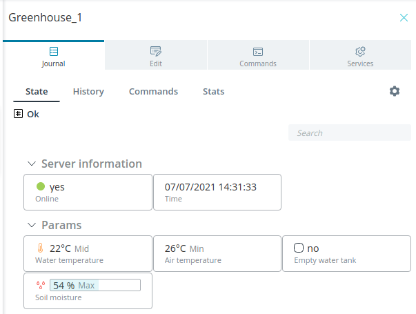

# Rightech IoT Cloud v2.4
*12 июля 2021, команда Rightech* 

Мы рады представить вашему вниманию очередной релиз Rightech IoT Cloud. В этом обновлении мы расширили функциональные возможности основных инструментов платформы.

Список основных изменений:
* [режим превью модели](#режим-превью) - предпросмотр интерфейсов объекта с выбранной моделью;
* [новый тип узла модели - конфигурация](#новый-тип-узла-модели---конфигурация) - новый тип параметров для конфигурирования объектов;
* [иконка модели](#иконка-модели)  - выбор и загрузка иконок для объекта;
* [иконка параметров](#иконка-параметра) - выбор и загрузка иконок для индикации параметров объекта;
* [фильтры для объектов](#фильтры) - новый фильтр для списка объектов;
* [групповые действия](#групповые-действия) - возможность управления сразу несколькими объектами;
* [выбор начальных координат](#выбор-начальных-координат) - выбор геопозиции на карте для объектов, которые не могут присылать GPS-данные;
* [настройки для обработчиков](#обработчики) - настройка для выбора источника входных данных обработчика, если необходимых параметров нет в пакете от устройства;
* [новый тип геозон - маршрут](#новый-тип-геозон---маршрут) - геозона-марушрут по графу дорог РФ;
* [новые возможности для мобильного приложения Rightech](#мобильное-приложение-rightech) - выбор проектов, фильтры и прочее.

### Модели
#### Режим превью
Добавлен новый режим предпросмотра модели - превью. Теперь в редакторе моделей возможно посмотреть, как будет выглядеть в журнале состояние объекта и интерфейс отправки команд.  

#### Новый тип узла модели - Конфигурация
К уже существующим типам узлов был добавлен новый - Конфигурация. Заполнение конфигурационных данных происходит на вкладке Редактирование объекта. Конфигурация - это параметры, значения которых задаются пользователем. Они могут использоваться в работе сценариев Логики, обработчиках и т.п. По своей сути, узлы с типом Конфигурация - это константы, которые необходимы для хранения дополнительной информации об объекте. Это может быть, к примеру,  максимально допустимая температура, объем топливного бака, длительность работы и т.п. Раньше для этих целей использовался узел типа Аргумент с включенной настройкой Записывать в конфигурацию. После выпуска релиза эти изменения автоматически будут применены ко всем пользовательским моделям.  

#### Иконка модели
Теперь для каждой модели можно выбрать свою иконку. Все объекты с такой моделью будут отображаться на карте с заданной иконкой. При этом можно как воспользоваться стандартными иконками, так и загрузить собственное изображение в формате SVG.

  

#### Иконка параметра
Аналогично выбору иконки для отображения объекта на карте появилась возможность задать иконку для параметра в модели.  
*Обратите внимание!*   
Иногда после загрузки SVG изображения его цвет не меняется в соответствии с выставленными уровнями. В этом случае откройте картинку через любой текстовый редактор и уберите поле “fill”. После этого загрузите обновленное SVG изображение еще раз. Теперь его цвет будет меняться согласно заданным уровням.  

### Объекты
#### Фильтры
Теперь для списка объектов доступен фильтр с расширенными возможностями.  

По умолчанию доступны 4 пресета фильтров:   
* онлайн - объекты, подключенные к платформе;  
* офлайн - объекты, отключенные от платформы;  
* отслеживаемые - объекты, для которых включен режим следования (за объектами закреплена/центрируется карта);
* с предупреждением - объекты, у которых есть непрочитанные критические сообщения.  
Настройка “и/или” определяет, как будут взаимодействовать активированные фильтры. Кроме того, вы можете создать свой собственный фильтр и сохранить его для повторного использования.   

#### Групповые действия
Добавлена возможность применять некоторые операции сразу к группе из нескольких объектов.  
Доступны 3 типа операций:
* *Изменить объекты* - применить групповые изменения на вкладке объектов “Редактирование”. Эта функция полезна, если необходимо изменить конфигурацию для нескольких объектов или, например, внести изменения в их описание.  

* *Отправить команду* - отправить одну и ту же команду на группу устройств. Результат исполнения команды по каждому объекту будет виден в интерфейсе групповых действий.

* *Изменить события геозон.*- выбрать  события, которые будут генерироваться при входе и выходе из геозоны для группы объектов. В списке для группового действия будут видны только те геозоны, которые назначены **на все выбранные объекты**.  

#### Выбор начальных координат
Теперь на вкладке редактирования объекта появилась возможность выбрать начальные координаты объекта. Если после этого объект пришлет свои координаты, то опция выбора координат перестанет быть доступной.

#### Визуализация для процентов
Небольшое улучшение отображения процентов в журнале объекта. Теперь для параметров, у которых выбрана единица измерения “проценты”, появляется шкала, которая заполняется в соответствии с полученным значением.

  
### Обработчики

В настройках обработчика теперь можно указать источник для входных данных, которых нет в пакете, поступившем на обработку.  Доступно на выбор 2 варианта:
* Брать последние присланное значение из истории;
* Заменять на null.
В первом случае вместо недостающих в пакете параметров будут браться последние присланные значения. Во втором - в обработчик будет передан null. Это позволит, например, исключить или изменить обработку неполных пакетов.

### Геозоны
#### Интерфейс создания геозон
Был упрощен и улучшен интерфейс создания новой геозоны. Теперь создание геозоны приближено к процессу создания других сущностей платформы.

#### Новый тип геозон - маршрут
Маршрут - это геозона, у которой выбрана начальная, промежуточные и конечная точки. Это точки автоматически соединяются между собой по графу дорог. Такой тип геозоны можно использовать для контроля отклонений передвигающегося объекта от заданного маршрута. Эти события можно использовать в сценариях Логики.

### Мобильное приложение Rightech
#### Переключение проектов
В настройках приложения появилась возможность сменить текущий проект. 

| | |
| :-: | :-: |
|  |  |
#### Экран Map

Несколько небольших, но заметных изменений на экране c картой:
* фильтр, примененный к списку объектов, остается активен если перейти на карту;
* добавлен новый маркер - местоположение пользователя (если приложению разрешено получать информацию о нем, проверьтt настройки ОС телефона);
* добавлена кнопка перехода в фильтр;
* добавлена кнопка центрирования на местоположении пользователя.

### Прочие изменения
* исправлено несколького багов нашего MQTT-брокера:
  * удалены ответы на пинг для неавторизованного объекта;
  * добавлен принудительный разрыв TCP-соединения, если авторизованный клиент пытается прислать второй CONNECT пакет;
* добавлены новые единицы измерения для параметров: рубли, доллары США, евро;
* изменены некоторые иконки в интерфейсе моделей;
* теперь редактировать модель можно через ее верхний узел (ранее было отдельное окно);
* исправлен баг с невозможностью удалить объект из пикера;
* теперь маркер на карте появляется после первой отправки координат (ранее приходилось обновлять страницу);
* исправлены проблемы, возникающие у некоторых пользователей с вводом цифр в поля для числовых значений в автоматах и ботах (не стирался последний в строке “0”, ввод дробных чисел иногда стирал значение и т.п.);
* у автоматов и обработчиков появилась кнопка, которая сразу позволяет применить фильтр к списку объектов и показать те объекты, которые связаны с этим обработчиком или автоматом;

* небольшие корректировки интерфейса ролей и API-токенов

---
Мы благодарим каждого, кто оставляет свои отзывы и предложения. Благодаря вам мы становимся лучше, продолжаем совершенствовать платформу, сохраняя при этом ее простоту использования.
Присоединяйтесь к нашим соцсетям и оставляйте обратную связь! 

Следите за новостями на нашем [Telegram-канале](https://t.me/rightechportal). В [Telegram-чате](https://t.me/rightech_iot) можно познакомиться с единомышленниками и получить ответы на имеющиеся вопросы.

Полезные ссылки:

* [Документация](https://rightech.io/developers/introductions/)
* [Видеоуроки](https://rightech.io/video-tutorials/)
* [Github](https://github.com/Rightech)
* [Сообщество ВК](https://vk.com/rightech)
* [Сообщество Facebook](https://www.facebook.com/rightechllc/)

