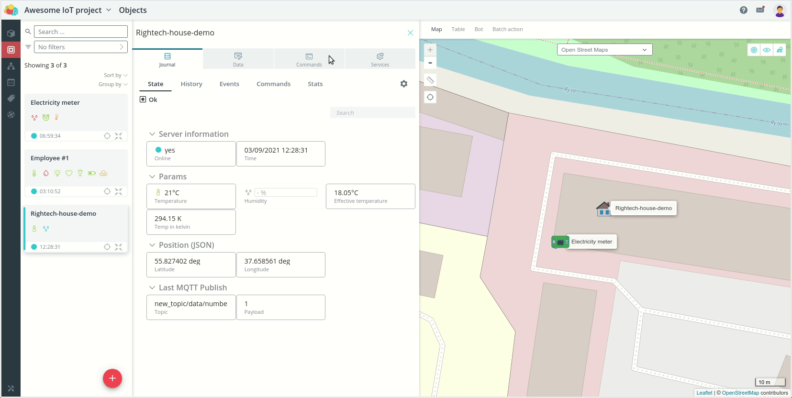

# Rightech IoT Cloud v2.5
*03 сентября 2021, команда Rightech* 

Рады представить вашему вниманию очередной релиз Rightech IoT Cloud. В этом обновлении мы расширили функциональные возможности основных инструментов платформы.

Список основных изменений:
* [автонаполнение модели](#автонаполнение-модели) -  режим для добавления новых параметров в модель;
* [команды с подстановками](#команды-с-подстановками) - настраиваемые перед отправкой параметры команды;
* [навигация по ошибкам обработчика](#навигация-по-ошибкам-обработчика) - ошибка, возникающая в процессе работы обработчика, фиксируется в истории пакетов как ссылка, по клику на которую можно перейти в код обработчика на строку, вызвавшую ошибку;
* [статус работы обработчика](#статус-работы-обработчика) -  новый статус "не выбраны параметры", который сообщает о необходимости соотнести входные и выходные параметры обработчика с соответствующими узлами модели;
* [интерфейс автоматов](#автоматы) - миникарта, сравнение параметров в условиях, поиск по списку параметров модели;
* [примечательные изменения](#примечательные-изменения) - список небольших исправлений и доработок в платформе.

### Объекты
#### Автонаполнение модели
Нередко при создании команды пользователь не знает заранее те значения, которые будет необходимо передавать как параметры, либо эти значения раз от раза могут меняться. Для создания параметра, значение которого можно указать непосредственно при отправке команды, необходимо при создании команды в модели объявить его в фигурных скобках {{param_name}}.
   
Режим запускается на 60 минут. После его включения все новые параметры отображаются в таблице, в которой пользователь может выбрать, какие из них необходимо добавить в модель. Эти параметры добавятся в модель в подсистему "unknown-parameters". Для их дополнительной настройки можно воспользоваться привычным редактором узлов в интерфейсе модели.  

  
### Модели
#### Команды с подстановками
Нередко при создании команды пользователь не знает заранее те значения, которые будет необходимо передавать как параметры. Для того чтобы создать параметр, который должен будет указываться перед отправкой необходим при создании команды объявить в фигурных скобках *{{param_name}}*.   

Также напоминаем о возможности передавать текущие параметры устройства в текст команды. Для этого достаточно указать в фигурных скобках object.state и после точки указать ID параметра из модели (например, {{object.state.temperature}}). При отправке команды будет подставлено значение этого параметра из журнала.

### Обработчики
#### Навигация по ошибкам обработчика
Теперь в истории пакетов видны ошибки, возникшие в процессе работы обработчиков. Текст ошибки помогает понять причину ее возникновения, а при клике на ошибку открывается обработчик на той строчке, которая вызвала эту ошибку. 

#### Статус работы обработчика 
Добавлен статус "Не выбраны параметры" для запущенного обработчика. Этот статус говорит о том, что требуется соотнести входные и выходные параметры обработчика с соответствующими узлами модели для корректной работы обработчика.  

### Автоматы
Добавлена возможность в условия одного перехода автомата включать параметры разных устройств и сравнивать эти параметры в том числе между собой.

Миникарта в интерфейсе автоматов перемещена в правый нижний угол. Появилась возможность ее сворачивать, что помогает при работе на небольших экранах. Над картой добавлены ссылки на модели, задействованные в этом в автомате.

### Примечательные изменения
Список небольших исправлений и доработок, основанный на отзывах наших пользователей:
* добавлена табуляция между разными уровнями токенов и изменено отображение цветных элементов в интерфейсе создания токенов;
* исправлен ряд проблем при работе с деревом модели в режиме drug&drop;
* добавлена возможность удалять выбранную иконку для параметров в модели (ранее была доступна только замена изображения);
* подгрузка пакетов в истории - новые пакеты сразу добавляются при просмотре истории;
* теперь для геозон-маркеров корректно отображается выбранный цвет;
* исправлен баг, когда описания переходов в автоматах генерировались с ошибками;
* исправлены проблемы с отправкой некоторых параметров с помощью ботов (с моделью Wialon), например, через интерфейс ботов не удавалось отправить скорость, равную 0;
* исправлен баг, из-за которого не отправлялась заполненная в ручном режиме команда Publish из автомата;
* увеличена зона отображения окна выбора геозон в групповом управлении объектами;

---
Мы благодарим каждого, кто оставляет свои отзывы и предложения. Благодаря вам мы становимся лучше, продолжаем совершенствовать платформу, сохраняя при этом ее простоту использования.
Присоединяйтесь к нашим соцсетям и оставляйте обратную связь! 

Следите за новостями на нашем [Telegram-канале](https://t.me/rightechportal). В [Telegram-чате](https://t.me/rightech_iot) можно познакомиться с единомышленниками и получить ответы на имеющиеся вопросы.

Полезные ссылки:

* [Документация](https://rightech.io/developers/introductions/)
* [Видеоуроки](https://rightech.io/video-tutorials/)
* [Github](https://github.com/Rightech)
* [Сообщество ВК](https://vk.com/rightech)
* [Сообщество Facebook](https://www.facebook.com/rightechllc/)