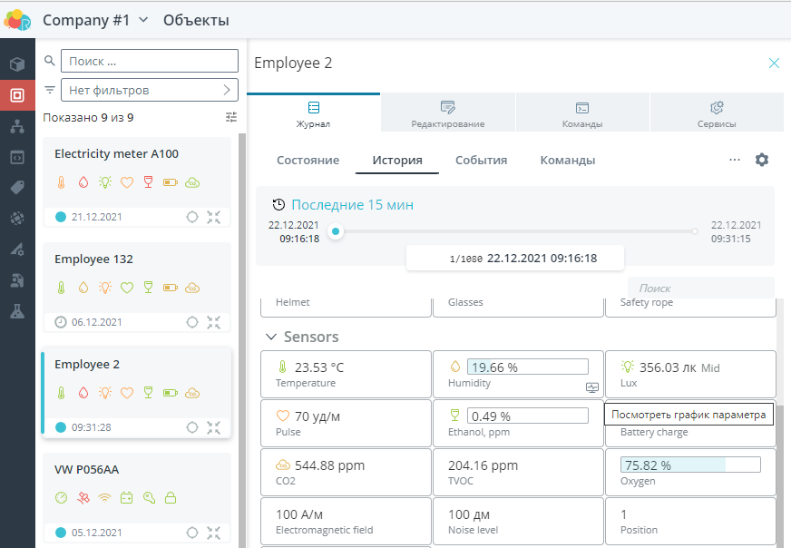
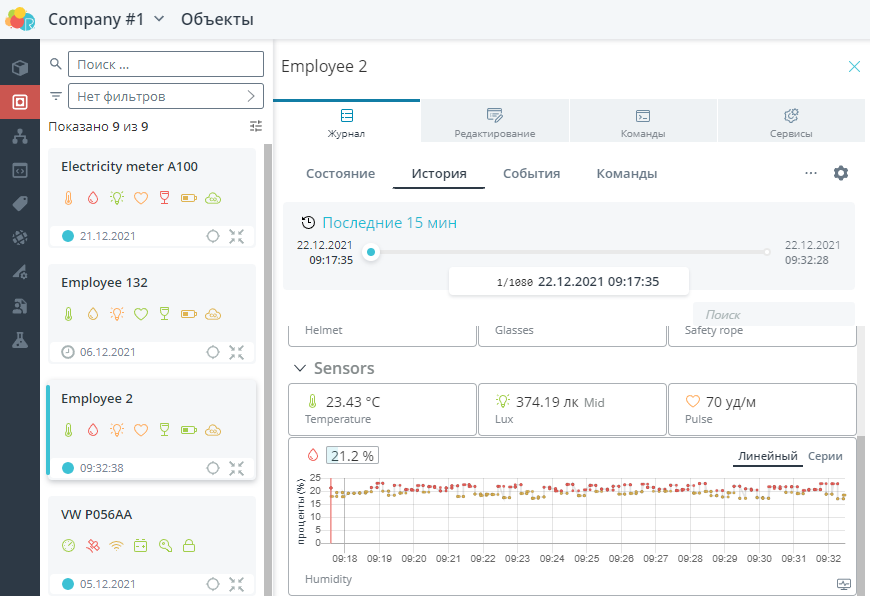

# Rightech IoT Cloud v2.6
*22 декабря 2021, команда Rightech* 

Рады представить вашему вниманию очередной релиз Rightech IoT Cloud. В этом обновлении мы расширили функциональные возможности основных инструментов платформы.

Список основных изменений:
* [Автоматы](#автоматы) - изменения в интерфейсе редактора;
* [Модели](#автоматическое-обновление-модели-после-внесения-изменений) - автоматическое обновление после внесения изменений;
* [Вебхуки](#вебхуки) - запуск обработчиков с помощью вебхука;
* [Режим тестирования обработчиков](#режим-тестирования) - изменения в интерфейсе и дополнительные возможности;
* [iOS приложение](#ios-приложение) - мобильная версия платформы теперь доступна и в App Store;
* [Критические пуши из автомата отправляются как уведомления в мобильное приложение Rightech](#Критические-пуши-из-автомата-отправляются-как-уведомления-в-мобильное-приложение-Rightech) - возможность включения уведомлений в мобильном приложении для критических сообщений из автоматов.

### Автоматы
Внесены изменения в интерфейс редактора автоматов. Изменена индикация выбора разных частей  автомата, их редактирования. Добавлено больше подсказок и информации о работе разных элементов платформы.
##### Состояния, действия и переходы
Состояния, действия и переходы стали кликабельным. Для выбранного элемента открывается боковое меню с возможностью редактирования. 
Состояние:  

Действие:

Переход:

##### Выбор событий
Изменена группировка событий и интерфейс их выбора. Все события поделены на две смысловые группы:  
* события автомата - базовые события каждого автомата, такие как события таймеров, планировщиков и мгновенный переход;
* события объекта - события из модели объекта, события геозон и события, связанные с изменением объекта (получение данных и редактирование  объекта)


##### Выбор действий
Изменена группировка действий и интерфейс их выбора. Все действия поделены на три смысловые группы:
* действия автомата - базовые действия каждого автомата, такие как управление таймерами и планировщиками, генерация событий и изменение значений;
* регистрация событий - действия, направленные на фиксацию момента входа/выхода в состояние;
* действия объекта - команды из модели объекта.


##### Выравнивание линий переходов
Исправлена проблема, когда расположение линий переходов не сохранялось в таком виде, как его настроил пользователь. 

#### Сквозная локализация базовых действий/событий
Теперь названия действий и переходов локализуются в соответствии с языком, выбранным в настройках аккаунта.
### Объекты
#### Подсказка по модели
В объекте в меню редактирования добавлена дополнительная информация по выбранной модели.  


#### Иконка для вызова графика по параметру
Добавлена новая иконка для вызова графика параметра. Напоминаем, что эта функция позволяет построить график за выбранный период. На экране состояния объекта график формируется за текущие сутки.
|||
|---|---|
|   |   | 

#### Cортировка и группировка объектов
Изменен интерфейс выбора сортировки и группировки для списков.
| Объекты | Другие сущности  |
|---|---|
|   |  | 

### Модели
#### Автоматическое обновление модели после внесения изменений
Добавлен механизм автоматического применения изменений в модели. Ранее, чтобы изменения в модели вступили в силу, приходилось отправлять команду "Обновить модель" или переподключать устройство к серверу. Сейчас любое изменение в модели (добавление нового параметра, редактирование уже существующих узлов и прочее) применяется сразу после сохранения.
#### Поля “Онлайн” и “Время сервера”
Поля "Онлайн" и "Время сервера" теперь всегда видны в интерфейсе объекта. В API объекта этим полям соответствуют идентификаторы online и _ts (хранится в UTC в микросекундах от 1 января 1970 года).

#### Быстрый фильтр по модели
На карточку в списке моделей добавлен счетчик для информации о количестве объектов, у которых выбрана эта модель. Эта информация позволяет оценить необходимость той или иной модели (нельзя удалить используемую модель). После клика на кнопку "Показать связанные объекты", открывается меню объектов с примененным к нему фильтром по выбранной модели.
|  |  |
|---|---|
|   |  | 

### Обработчики
#### Вебхуки
Добавлена возможность инициировать срабатывание обработчика с помощью внешнего вызова - вебхука. В тело запроса можно передать данные, которые могут быть использованы для работы обработчика. Чтобы добавить этот механизм нужно:
1. Создать для обработчика вебхук  
 
2. Скопировать вебхук из соответствующего поля. 
3. Добавить в URL вебхука вместо поля ":id" идентификатор объекта, на котором нужно запустить обработчик.  
 
| Сгенерированный URL | Как получить идентификатор объекта |
|---|---|
|   |  | 

4. Добавить полученный вебхук в необходимый сервис.

##### Пример использования вебхука
Рассмотрим пример добавления кнопки с помощью сервиса [IFTTT](https://ifttt.com/), которая будет отправлять координаты с мобильного телефона в объект в платформе. Сам обработчик можно скачать [тут](https://github.com/Rightech/ric-examples/tree/master/cases/Webhook%20example).   
На сервисе IFTTT достаточно просто можно создать кнопку, которая будет отправлять геопозицию мобильного телефона по нажатию. Для этого нужно создать новый Applet и добавить в него вебхук из обработчика Rightech.
Итоговый Applet выглядит следующим образом:  

<p align="left">
  <a href="http://rightech.io">
    
  </a>
</p>

Настройка вебхука в IFTTT:  

<p align="left">
  <a href="http://rightech.io">
    
  </a>
</p>

В этом примере в тело запроса передаются координаты вашего мобильного устройства.  
В коде обработчика можно обработать полученные данные так, как вам необходимо. Если требуется, можно определить формат ответа, который будет отправляться в ответ на вебхук.

Пример кода обработчика:  
``` function process() {
  const body = ric.webhook?.request?.body ?? {};

  const lat = +(body.lat || 0);
  const lon = +(body.lon || 0);

  /* handler replies with `200 OK` json response by default (if no error occurred)
     but you can override with: */
  // ric.webhook.respondWith({ status: 403, body: { ok: false } });  

  return { lat, lon };
}
```  
Этот обработчик проверяет наличие полей lat/lon в теле запроса и, если они не нулевые, записывает полученные значения в объект. При работе с конструкциями "ric.webhook" редактор подсказывает возможные опции ввода. 
Подсказки в обработчике:  

#### Режим тестирования
Переработан экран с запуском тестирования обработчиков.   
 
Помимо обновления интерфейса, теперь код можно редактировать при запущенном режиме тестирования. Выполнение теста работает даже на несохраненном коде обработчика, чтобы не было необходимости сохранять еще не проверенный код.
 

### Аккаунты
#### Удаление проектов
Добавлена возможность удалить проект, у которого нет оплаченного периода. Проект удаляется безвозвратно. Будьте внимательны при выполнении этой операции.  
|  |  |
|---|---|
|  |  | 
#### Применение изменений для ролей приглашенных в проект пользователей
Обновлена работа с применением изменений в ролях приглашенных в ваш проект пользователей. Сейчас все внесенные изменения вступают в силу сразу же после нажатия на кнопку “Сохранить”.
### Мобильное приложение
#### iOS приложение
Приложение Rightech добавлено в [App Store](https://apps.apple.com/ru/app/rightech/id1540955096). Оно обладает основными возможностями платформы, связанными с контролем в режиме реального времени состояния и местоположения объектов, позволяет управлять объектами посредством отправки команд, следить за оповещениями. 
Приложение для Android также доступно в Play Market по [ссылке](https://play.google.com/store/apps/details?id=io.rightech.app&hl=en_US).

#### Критические пуши из автомата отправляются как уведомления в мобильное приложение Rightech
Критические сообщения, сгенерированные автоматом, могут быть получены также и на ваш мобильный телефон. Для этого необходимо включить соответствующую настройку в приложении Rightech.
|  |  |
|---|---|
|  |  | 

---
Мы благодарим каждого, кто оставляет свои отзывы и предложения. Благодаря вам мы становимся лучше, продолжаем совершенствовать платформу, сохраняя при этом ее простоту использования.
Присоединяйтесь к нашим соцсетям и оставляйте обратную связь! 


Следите за новостями на нашем [Telegram-канале](https://t.me/rightechportal). В [Telegram-чате](https://t.me/rightech_iot) можно познакомиться с единомышленниками и получить ответы на имеющиеся вопросы.

Полезные ссылки:

* [Документация](https://rightech.io/developers/introductions/)
* [Видеоуроки](https://rightech.io/video-tutorials/)
* [Github](https://github.com/Rightech)
* [Сообщество ВК](https://vk.com/rightech)
* [Сообщество Facebook](https://www.facebook.com/rightechllc/)