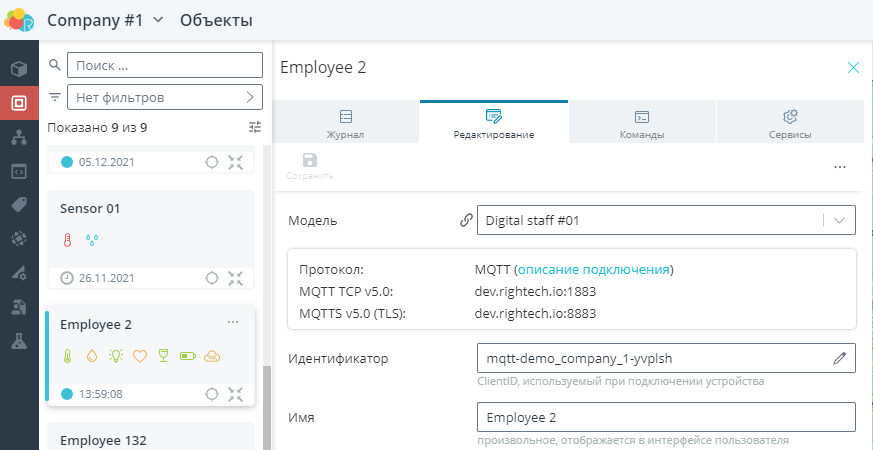

# Rightech IoT Cloud v2.6
*22 декабря 2021, команда Rightech* 

Рады представить вашему вниманию очередной релиз Rightech IoT Cloud. В этом обновлении мы расширили функциональные возможности основных инструментов платформы.

Список основных изменений:
### Автоматы
Внесены изменения в интерфейс редактора автоматов. Изменена индикация выбора элементов автомата, их настройки. Добавлено больше подсказок и информации о работе разных элементов платформы.
##### Состояния, переходы и действия
Состояния, переходы и действия стали кликабельным. Выбранный элемент визуально выделяется в редакторе. По клику открывается боковое меню с возможностью изменить редактировать этот элемент
Состояние:  

Действие:

Переход:

##### Выбор событий
Изменена группировка события и инетерейс их выбора. Все события поделены на две смысловые группы:  
* события автомата - базовые события каждого автомата, такие как события таймеров, планировщиков и ммгновенный переход;
* события объекта - события из модели объекта, события геозон и события связаные с изменением объекта (получение данных и редактирвоание объекта)

##### Выбор действий
Изменена группировка события и инетерейс их выбора. Все события поделены на три смысловые группы:  
* действия автомата - базовые действия каждого автомата, такие как управление таймерами и планировщиками, сгенерировать событие и изменить значение;
* регистрация событий - действия, направленные фиксацию момента входа/выхода в состояние;
* действия объекта - команды из в модели объекта.

##### Выравнивание линий переходов
Исправлена проблема? когда расположение линий у переходов не сохранялось так, как ее настроил пользователь. 

#### Сквозная локализация базовых действий/событий
Исправлена проблема при создании действий и переходов, когда их имена зависили от выбранного языка пользователя. Сейчас этих действий соответствует выбранному языку в настройках аккаунта и по возможности локализуется вместе со всем интерфейсом платформы.
### Объекты
#### Подсказка по модели
В объекте в меню редактирования добавлена дополнительная информация по выбранной модели. 

#### Иконка для вызова графика по параметру
Добавлена новая иконка для вызова графика параметра. Напоминаем, что эта функция позволяет построить график за выгруженный период. На экране состояния объекта график будет формироваться за текущие сутки.
|   |   |
|---|---|
|   |   | 

#### Cортировка и группировка объектов
Изменен интерфейс сортировки и группировки для списков в меню объектов и сортировки для других списков.
| Объекты | Другие сущности  |
|---|---|
|   |  | 

### Модели
#### Автоматическое обновление модели после внесения изменений
Добавлен механизм автоматического применения изменений в модели. Ранее, чтобы измения в модели вступили в силу приходилось отправить команду "Обновить модель" или дождаться переподключение устройства к серверу. Сейчас любое изменение в модели (добавление нового параметра, редактирование уже существуеющих узлов и прочее) применяется сразу после сохранения. 
#### Поле онлайн и поле время сервера
Поля "Онлайн" и "Время сервера" теперь всегда видны в интерфейсе объекта. В API объекта этим полям соответсвует идентификаторы _id и _ts (хранится в UTC в микросекундах от 1 января 1970 года)  

#### Быстрый фильтр по модели
На карточку в списке моделей добавлен счетчик для информации о количестве объектов у которых выбрана эта модель. Эта информация необходима для понимания необходимости той или иной модели (нельзя удалить используемую модель). После клика на кнопку "Показать связанные объекты", открывается меню объектов с применным к нему фильтром по выбранной модели.
|  |  |
|---|---|
|   |  | 

### Обработчики
#### Вебхуки
?
#### Режим тестирования
Переработан экран с запуском тестирования обработчиков.   
 
Помимо визуальных изменний теперь код можно редактировать при запущенном режиме тестирования. Теперь запуск теста применяется даже для несохраненного кода обработчика.
 

### Аккаунты
#### Удаление проектов
Добавлена возможность удалить проект у которого нет оплаченного периода. Проект удаляется безвозратно. Будьте внимательны при использовании этой операции.
|  |  |
|---|---|
|  |  | 
#### Мгновенное примениние изменений для ролей приглашенных в проект пользователей
Обновлена работа с применением изменений в ролях приглашенных в ваш проект пользователей. Сейчас  все внесенные изменения вступают в силу сразу же после нажатия на кнопку сохранить. 
### Мобильное приложение
#### iOS версия
Приложение Rightech добавлено в [App Store](https://apps.apple.com/ru/app/rightech/id1540955096). Приложение обладает основными возможностями платформы, связанными с контролем в режиме реального времени состояния объектов и их местоположения, позволяет управлять объектами посредством отправки команд, следить за оповещениями. 
Приложение для Android также доступно в Play Market по [ссылке](https://play.google.com/store/apps/details?id=io.rightech.app&hl=en_US)

#### Критические пуши из автомата отправляются как уведомления в мобильное приложение Rightech
Критические сообщение сгенерированные автоматом могут быть присланы так же на ваш мобильный телефон. Для этого необходимо включить соответствующую настройку в приложении.
|  |  |
|---|---|
|  |  | 

---
Мы благодарим каждого, кто оставляет свои отзывы и предложения. Благодаря вам мы становимся лучше, продолжаем совершенствовать платформу, сохраняя при этом ее простоту использования.
Присоединяйтесь к нашим соцсетям и оставляйте обратную связь! 

Следите за новостями на нашем [Telegram-канале](https://t.me/rightechportal). В [Telegram-чате](https://t.me/rightech_iot) можно познакомиться с единомышленниками и получить ответы на имеющиеся вопросы.

Полезные ссылки:

* [Документация](https://rightech.io/developers/introductions/)
* [Видеоуроки](https://rightech.io/video-tutorials/)
* [Github](https://github.com/Rightech)
* [Сообщество ВК](https://vk.com/rightech)
* [Сообщество Facebook](https://www.facebook.com/rightechllc/)